<h1 align="center">Hi 👋, I'm Kiran Teja</h1>
<h3 align="center">Backend Engineer specialized in Production-Grade Distributed Systems</h3>

  Performance-driven Backend Engineer focused on designing asynchronous workflows, event-driven architecture, and optimizing data infrastructure. Thriving in fast-paced startup environments to deliver scalable, high-throughput backend systems.

- 🚀 **Core Stack:** FastAPI, SQLAlchemy 2.0, Pydantic V2, Slim (PHP)
- 🗄️ **Data & Caching Infrastructure:** PostgreSQL, MySQL, Redis (Advanced Key/TTL Design)
- 🏗️ **Distributed Systems & Event Streaming:** Apache Kafka, Kafka Streams, Debezium (CDC), AWS SQS
- 🐳 **DevOps & Cloud Ecosystem:** AWS (EC2, S3, RDS), Docker, Docker Compose, Traefik
- 💬 **Ask me about:** Python Performance, Query Optimization, System Design, Asynchronous Processing Pipelines
- 📫 **Reach me at:** [kiranteja.kandiboyina@gmail.com](mailto:kiranteja.kandiboyina@gmail.com)
- 📄 **Resume/Experiences:** [View My CV](https://docs.google.com/document/d/1rcM4NieywzzvfFmu7pUrDo8EhWmNWzduoqi5QAasPNk/)

---

### 🛠️ Languages and Tools

#### **Core Backend, Data & Infrastructure**

  
  
  
  
  
  
  
  
  
  

#### **Secondary Stack / Prior Context**

  
  
  
  

---

### 📊 Git Metrics

